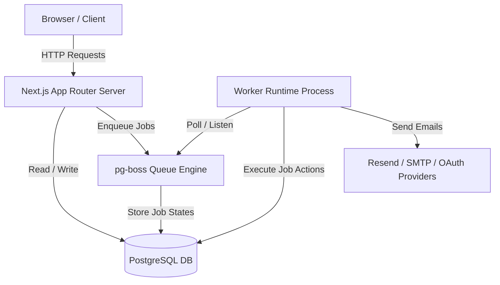

# Omni Communications — Platform Architecture Freeze (v1.0)

This document formalizes the baseline architecture, structural layers, subsystem boundaries, extension rules, and coding standards for Omni Communications. 

> [!IMPORTANT]
> **Architecture Freeze Declaration**: 
> As of version 1.0, the system architecture of Omni Communications is officially **FROZEN**. No structural modifications, refactorings, or database schema re-designs should occur hereafter unless explicitly mandated by production bugs or newly approved feature footprints.

---

## 1. System Architecture Overview

Omni Communications is a multi-tenant campaign management and mailing system designed for deployment on a single virtual private server (VPS). The system consists of two primary runtime engines utilizing a shared PostgreSQL database instance:



1. **Next.js App Router Server**: Serves static pages, executes Server Actions, exposes public REST APIs, Webhook endpoints, and real-time Telemetry metrics.
2. **Worker Process Runtime**: Runs as a separate Node process (`dist/worker.js`) executing long-running transactional work (e.g. campaign audience fanouts, synchronization of connected mailboxes).

---

## 2. Structural Layering & Boundaries

The codebase is organized into vertical core domain packages under `src/core/` and unified system libraries under `src/lib/`. Boundaries must be strictly maintained:

```
src/
 ├── app/                  # Next.js page routes, layouts, and server actions
 ├── components/           # Reusable UI component elements (Shadcn/Tailwind)
 ├── core/                 # Vertical domain modules (Domain Boundary)
 │    ├── projects/        # Project tenancy & members mapping
 │    ├── campaigns/       # Campaigns and email enqueuing engine
 │    ├── mailboxes/       # Connected mailboxes, providers, and OAuth binds
 │    └── suppressions/    # Opt-outs and suppression lists
 ├── db/                   # Database schemas and Drizzle client configuration
 └── lib/                  # Unified system utilities (Tracing, Sanitizer, Logger)
```

### 2.1 Layering Rules
* **UI Actions & Loaders (`src/app/`)**: Coordinate user interactions, validate HTTP/FormData inputs, resolve user sessions, and delegate directly to core domain services. They should never write directly to database tables.
* **Domain Services (`src/core/<domain>/<name>.service.ts`)**: House business rules. They check project permissions, validate domain transitions, write audit logs, and coordinate repository writes.
* **Domain Repositories (`src/core/<domain>/<name>.repository.ts`)**: Perform Drizzle queries. No business logic or permission checks belong here; queries are database-centric.
* **System Utilities (`src/lib/`)**: Pure cross-cutting concerns (such as structured JSON logging, tracing contexts, IP resolution, and HTML sanitization) that have no dependency on business domains.

---

## 3. Core Coding Conventions & Patterns

### 3.1 Session & Project Authorization
All actions and loaders must resolve context using the canonical `requireProjectSession` or `requireProjectSessionForAction` helper:
```typescript
import { requireProjectSession } from "@/lib/auth-helpers";

// In Page Loaders / Server Components:
const { user, project, actor } = await requireProjectSession(projectId);
```
This guarantees consistent project scoping, active session resolution, and resolves the actor's audited IP address safely.

### 3.2 Unified Error System
All custom errors must inherit from the unified `AppError` base class:
```typescript
import { AppError } from "@/lib/errors";

export class ProjectError extends AppError {
  constructor(message: string, code: ProjectErrorCode, statusCode: number = 400) {
    super(message, code, statusCode);
  }
}
```

### 3.3 HTML Sanitization
For previewing or processing user-contributed HTML, sanitize strings using `sanitizeHtml` from [src/lib/sanitizer.ts](file:///Users/macintoshhd/.gemini/antigravity-ide/scratch/omni-communications/omni/src/lib/sanitizer.ts). Inline event handlers and scripts must be stripped.

### 3.4 OpenTelemetry & Tracing
Wrap database operations, HTTP requests, worker jobs, and heavy loops inside `trace`:
```typescript
import { trace } from "@/lib/tracing";

await trace("service.actionName", async (span) => {
  // Execute work...
});
```

---

## 4. Extension Guidelines

1. **Adding Database Fields / Tables**: 
   Define new schemas inside `src/db/schema.ts` (or core schemas files) and generate migrations using `npm run db:generate`.
2. **Adding a Worker Queue Job**:
   Define queue name inside `src/lib/queue/jobs.ts`, register a listener in `src/worker/index.ts` under a child trace context, and call through to the service layer.
3. **Adding a New Domain Feature**:
   Create a dedicated subdirectory under `src/core/<feature>` with schema, service, repository, and test suites. Do not cross-import repositories across domains; call through their public service interfaces.
